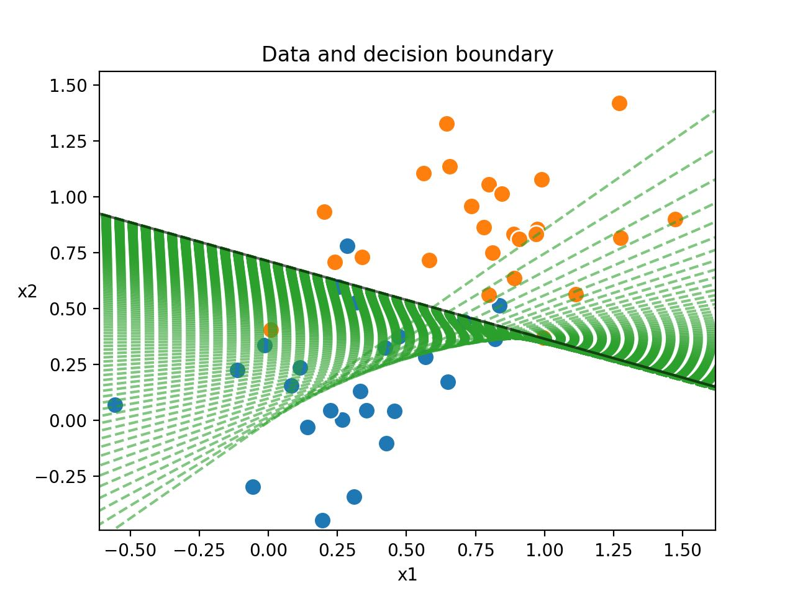

# Binary Classification Task
## Assignment for *"Neural Networks and Deep Learning"* class at UNSW
### Received mark: 16/16

In this part, we will develop a linear model to solve a binary classification task on two dimensional data. The file https://www.cse.unsw.edu.au/~cs9444/19T3/hw1/hw1/data/ contains the data for this part. We have included the file used to generate the data as *data_generator.py*. You may examine this for your reference, or modify it if you wish to watch Gradient Decent take place on different data. Note that running this file will replace the pickle file with another stochastically generated dataset. This shouldn't cause your solution to fail, but it will cause the final output image to appear different. It is good to check that your file works with the original pickle file provided.

A correct implementation should produce the following image, along with model accuracies at each training step printed to *stdout*:

Example output from a correctly implemented Part 2.

This shows the provided datapoints, along with the decision boundary produced by your model at each step during training (dotted green lines). You can see that the data is not linearly separable, however the optimal separating plane is still found. For this data and model, it is impossible to achieve 100% accuracy, and here only 92% or 94% is achieved (with one point lying very close to th boundary).
